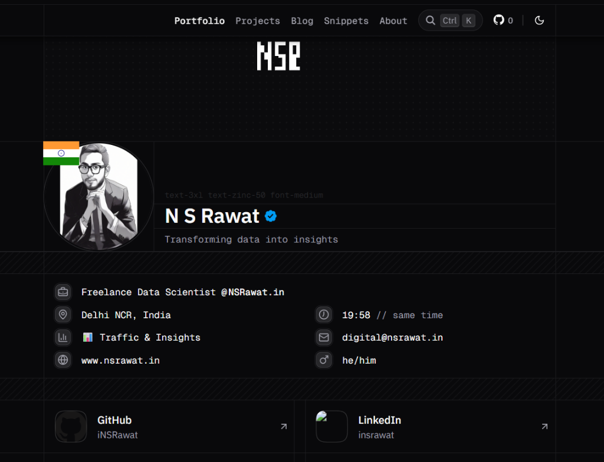

<h1 align="center">N S Rawat Data Science Journey</h1>

My passion for data analysis and machine learning drives me to explore insights and build intelligent solutions.

 

Loved the project? Please visit my <a href="https://nsrawat.in/">Portfolio</a>

 

## Portfolio Website

 

## Tech Stack

This blog is hosted on [Vercel](https://vercel.com/), built with [Next.js](https://nextjs.org/) and [Tailwind CSS](https://tailwindcss.com/) using **Tailwind Nextjs Starter Blog**.

This blog site takes inspiration from [karhdo.dev](https://github.com/Karhdo/karhdo.dev) & [lehuynh.dev](https://github.com/hta218/leohuynh.dev). I appreciate Karhdo, Leo Huynh and Timothy Lin for their contribution to this minimal, lightweight, and highly customizable blog starter.

 

### A few major over-engineering-changes from the original repo:

- ⚛️ Upgrad to **React 19**, **Next.js 16**
- 🎉 Adopting **TypeScript**, committing with [Conventional Commits](https://www.conventionalcommits.org/)
- 👀 Theming in dark mode with [Tokyonight Neovim Theme](https://github.com/folke/tokyonight.nvim) colors for better contrast.
- 👨‍💻 My website refers to the design and code from the [Karhdo.dev](https://github.com/Karhdo/karhdo.dev) & [lehuynh.dev](https://github.com/hta218/leohuynh.dev) repository and incorporates the tailwind-nextjs-starter-blog template, version 1.0.
- 📥 Bumping up `mdx-bundler`, `rehype`/`remark` plugins and dependencies to the latest version

 

## My Data Science Focus

I specialize in:

- **Predictive Analytics**: Building machine learning models for forecasting and classification
- **Data Visualization**: Creating insightful visualizations using Power BI, Tableau, and Python libraries
- **Statistical Analysis**: Applying statistical methods to extract meaningful patterns from data
- **Deep Learning**: Developing neural networks for complex pattern recognition tasks
- **Business Intelligence**: Transforming raw data into actionable business insights

 

## Express Your Support

If you find my data science projects helpful, show your appreciation with a ⭐

 

## Data & Resources

The datasets used in my projects come from [Kaggle](https://www.kaggle.com/), [UCI Machine Learning Repository](https://archive.ics.uci.edu/), and various public data sources. Visualizations are created using [Plotly](https://plotly.com/), [Matplotlib](https://matplotlib.org/), and [Seaborn](https://seaborn.pydata.org/).

Extending sincere thanks for these exceptional resources 🙏

 

---

Inspired by <a href="https://github.com/Karhdo/karhdo.dev">Karhdo/karhdo.dev</a> and <a href="https://github.com/hta218/leohuynh.dev">hta218/leohuynh.dev</a>

 

Copyright © 2025 - N S Rawat (NSRawat)
